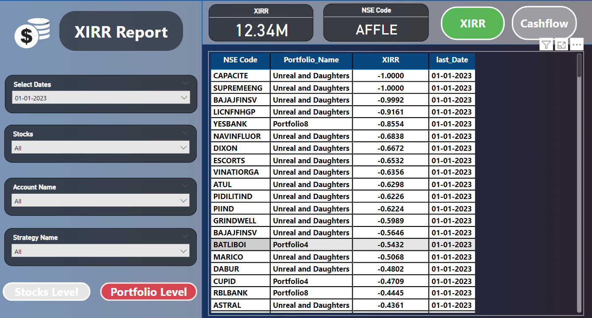

# Finance Project

This repository contains all the necessary files and scripts for calculating XIRR and visualizing the results through a Power BI dashboard. The project includes SQL scripts, Python code, data files, and documentation.

## Repository Structure

- **Powerbi_file**
  - `xirr_dashboard_post.pbix` : Power BI dashboard file for visualizing XIRR results.
  
- **sql_data_for_Powerbi**
  - `finance_project.sql` : SQL script for setting up the database and necessary tables.
  
- **XIRR_Code_with_Documentation**
  - `ADD_Tables_SQLDATEBASE.py` : Python script for adding tables to the SQL database.
  - `code_lastdate_startingdate.py` : Python script for calculating XIRR using the last date and starting date.
  - `code_with_lastdate.py` : Python script for calculating XIRR with a focus on the last date.
  - `Instructions.txt` : Instructions for running the Python scripts and setting up the environment.
  - `Share_Trading_Full.csv` : CSV file containing the share trading data.
  - `XIRR Documentation.docx` : Detailed documentation of the XIRR calculation process.

## Project Overview

This project aims to calculate the XIRR (Extended Internal Rate of Return) using trading data. The calculated XIRR is then visualized using a Power BI dashboard, which connects to a PostgreSQL server to fetch and display data.

### Files and Their Roles

1. **Power BI Dashboard**
   - `xirr_dashboard_post.pbix` : This file contains the dashboard created in Power BI to visualize the calculated XIRR.

2. **SQL Data for Power BI**
   - `finance_project.sql` : SQL script used to set up the PostgreSQL database and tables required for storing and retrieving trading data.

3. **XIRR Code with Documentation**
   - `ADD_Tables_SQLDATEBASE.py` : Script for adding the necessary tables to the PostgreSQL database.
   - `code_lastdate_startingdate.py` : Script to calculate XIRR based on the last date and starting date from the dataset.
   - `code_with_lastdate.py` : Another script for calculating XIRR with emphasis on the last date.
   - `Instructions.txt` : Provides detailed instructions on how to execute the scripts and set up the environment.
   - `Share_Trading_Full.csv` : Contains the share trading data used for XIRR calculations.
   - `XIRR Documentation.docx` : Comprehensive documentation explaining the XIRR calculation process.

### Instructions

1. Set up the PostgreSQL database using the `finance_project.sql` script.
2. Run `ADD_Tables_SQLDATEBASE.py` to add the necessary tables to the database.
3. Use `code_lastdate_startingdate.py` or `code_with_lastdate.py` to calculate XIRR based on your preferred methodology.
4. Follow the instructions in `Instructions.txt` for detailed steps and troubleshooting.
5. Open `xirr_dashboard_post.pbix` in Power BI to visualize the results.

## Additional Information

For more details on the XIRR calculation and the scripts used, refer to `XIRR Documentation.docx`.

## License

This project is licensed under the MIT License - see the LICENSE file for details.

